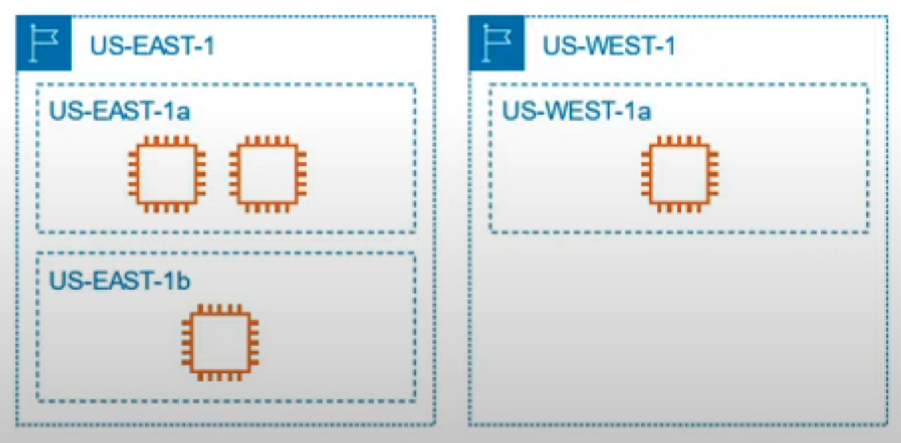

# Global Infrastructure :earth_americas:

Globally distributed hardware and datacenters that are physically networked together to act as one large resource for the end customer.

AWS Cloud infrastructure is built around:

- Regions: physical location in the world where we have multiple (physically separated) Availability Zones within the same geographical region.

- Availability Zones: one or more discrete data centers, each with redundant power, networking, and connectivity, housed in separate facilities. An AZ is made up of one or more datacenters. All AZs in a Region are interconnected with high-bandwidth, low latency networking, over fully redundant, dedicated metro fiber providing high-throughput. Al All traffic between AZs is encrypted. AZs are represented by a Region Code followed by a letter identifier eg. us-east-1**a**

- Direct Connection Locations

- Points of Presence

- Local Zone

## Regions, AZ and services
- Each region generally has three AZ (US-EAST-1 region has 6 AZs!)
- New services almost always become available first in **US-EAST**
- Not all services are available in all regions
- The cost of AWS services vary per region
- All your billing information appears in US-East-1

## Diagram example

## US-East 1 region
The most important region is **US-East 1** (Northern Virginia 1). AWS's first region, launched SQS and S3. Special use cases where things only work in US-East 1 (all your Billing information)

Customers can use AWS to place instances and store data across regions known as Regions. Each region is a self-contained collection of AWS resources in a specific geographical area

AWS provides a lot of services and these services are either Global, Regional, or Availability Zone specific and cannot be accessed outside. Most of the AWS-managed services are regional-based services with few exceptions being Global (e.g. IAM, Route53, CloudFront, etc) or AZ bound.

## Regional Services
AWS scopes their AWS Management Console on a selected Region (top corner drop-down). This will determine where an AWS service will be launched and what will be seen within an AWS Service console. You don't set explicitly the region at the time of creation. 

AWS services process and store customer content in the AWS region(s) where the services are used by the customer.

## Considerations
Except as otherwise specified, Global Services
— AWS Identity and Access Management (IAM)
- AWS Organizations
- Amazon CloudFront
- Amazon Route53
- AWS Global Accelerator
- AWS Direct Connect,
- AWS Firewall Manager
- AWS Web Application Firewall (WAF)
- WS Shield

may store and process data globally. AWS services generate internal operational data—that does not include customer content—to operate, maintain, and improve the services. Internal operational data, such as data used to meter usage, generate customer bills and label resources may be processed in the AWS regions used by the customer and other regions.

## Global Services
Some services operates across multiple regions andd the region will be fixed to 'Global'

The only 'real' global services are:

- Amazon CloudFront: Operates out of hundreds of locations around the world
- Amazon Route 53: Operates out of dozens of locations around the world
- Amazon IAM: Permission changes in one region are automatically copied to all regions

### Other Global connotations

- Note that in spite of S3 being Regional in terms of physical storage, S3 names are global logically.

- Cost Explorer and Support don't actually use or deploy any services on your behalf. And a 'global view' is just a view -- similar to viewing all S3 buckets, but not actually deploying resources globally.

- EC2 instances are regional: EC2 Instance from one region can be exposed to Public/Internet through Internet Gateway. This way your App even though hosted in say Asia-Pacific Region (physical Servers) will be accessible from everywhere.

More on:

[Andrew Brown ExamPro Cloud Practitioner Free Course](https://youtu.be/SOTamWNgDKc)

[SO Answer](https://stackoverflow.com/a/68815658/5425908)

[Essentials](https://aws.amazon.com/getting-started/cloud-essentials/?ref=gs&id=m1)

[AWS global infrastructure](https://ipspecialist.net/what-is-aws-global-infrastructure/)

