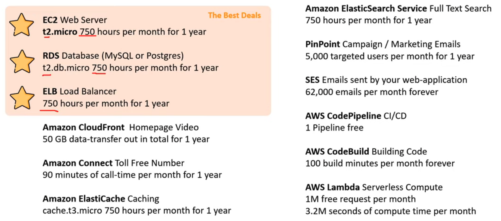

# AWS Free tier :free:

Provides customers the ability to explore and try out AWS services free of charge up to specified limits for each service

 Comprised of three different types of offerings: 
 - **12-month Free Tier**: allow customers to use the product for free up to specified limits :stop_sign: for one year :calendar: from the date the account was activated

 - **Always Free offer**: allow customers to use the product for free up to specified limits :stop_sign: as long as they are an AWS customer (do not expire)

 - **Short term trials**: free to use for a specified period of time :calendar: or up to a one-time limit :stop_sign: depending on the service selected.

 
Details on the limits and services provided for free are detailed in each card on the Free Tier page. If your application use exceeds the free tier limits :stop_sign:, you simply pay standard, pay-as-you-go service rates :credit_card:.

## Billing
If you have not exceeded the limits of the free tier, you may have been charged for other AWS services that are not covered under the free tier. Some examples include: if you are running an Amazon EC2 t2.small instance rather than a t2.micro instance, or if you are using a service not included in the offer, such as Amazon Aurora.

## Regions
The AWS Free Tier applies to participating services across our global regions. Your free usage under the AWS Free Tier is calculated **each month** across **all regions** and automatically applied to your bill.

For example, you will receive 750 Amazon EC2 Linux Micro Instance hours for free across all of the regions you use, not 750 hours per region. 

Unused monthly usage will not roll over to future months.

More on 

[Andrew Brown ExamPro Cloud Practitioner Free Course](https://youtu.be/SOTamWNgDKc)

[Free tier FAQs](https://aws.amazon.com/free/free-tier-faqs/?nc1=h_ls)