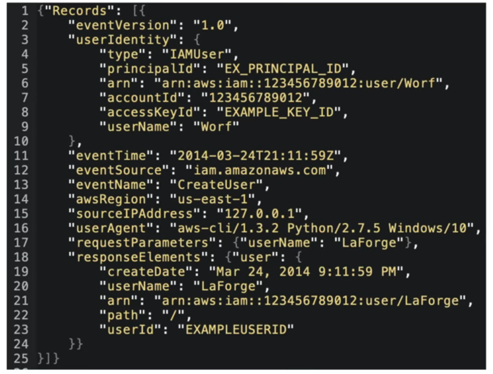

## Logging Services
## Cloud Trail

Is a service that enables governance, compliance, operational auditing, and risk auditing of your AWS account.

You can log, continuously monitor, and **retain account activity related to actions across your AWS infrastructure**.

Cloud Trail logs all API calls (SDK, CLI) between AWS services to:

- detect who did things:
  - who created this bucket?
  - who spun up that expensive EC2 instance?
- To detect developer misconfiguration
- Detect malicious actors
- Automate responses through the system

Easily identify which users and accounts made the call to AWS eg.:

- Where? Source IP address
- When? EventTime
- Who? User, UserAgent
- What? Region, Resource, Action

## Cloud watch
Collection of multiple services,
"umbrella service" so many things underneath it:

- Logs: A centralized place to store your cloud services log data or app's logs
- Metrics: represent a time-ordered set of data points or a variable to monitor
- Events (EventBridge) trigger an event based on a condition eg. every hour take a snapshot of server
- Alarms trigger notifications based on metrics
- Dashboard create visualization based on metrics

### CloudWatch Alarms
Monitors a CloudWatch Metric based on a defined threshold
Setting up a billing alarms.

## AWS X-Ray

AWS X-Ray is a service that collects data about requests that your application serves, and provides tools to view, filter, and gain insights into that data to identify issues and optimize. 

Is a distributed tracing system. You can use it to pinpoint issues within your microservices. See how data moves from one app to another, how long it took to move, and if it failed to moved forward. 

Instead of sending trace data directly to X-Ray, each **client SDK** sends JSON segment documents to a daemon process listening for UDP traffic. The **X-Ray daemon** buffers segments in a queue and uploads them to X-Ray in batches. The daemon is available for Linux, Windows, and macOS, and is included on AWS Elastic Beanstalk and AWS Lambda platforms.

X-Ray uses trace data from the AWS resources that power your cloud applications to generate a detailed service map. 

[More info](https://docs.aws.amazon.com/xray/latest/devguide/aws-xray.html)

