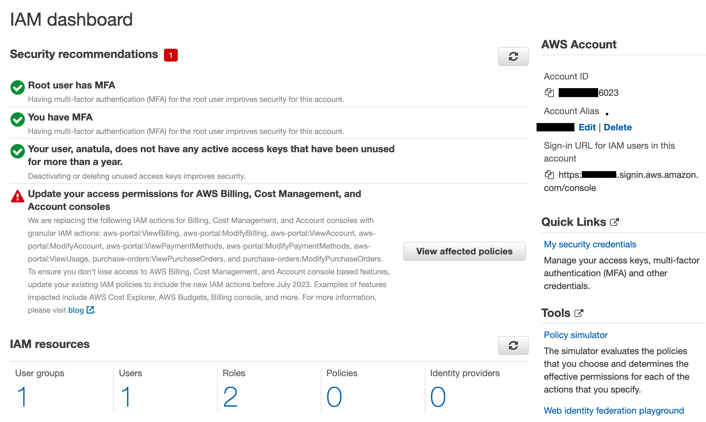
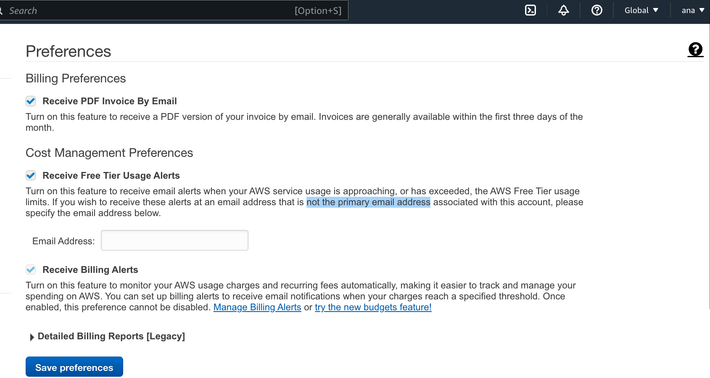
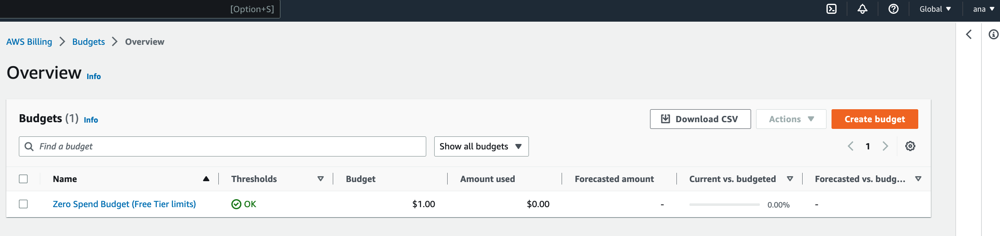
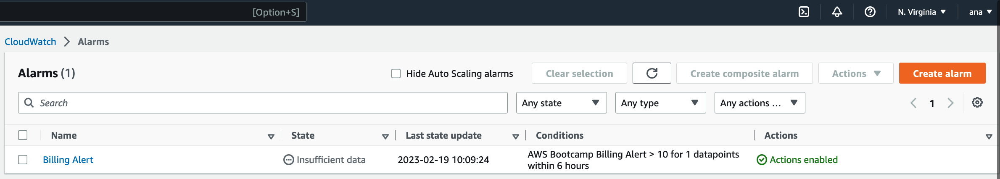
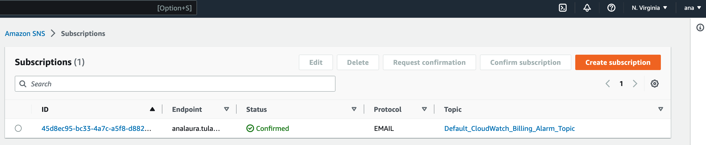
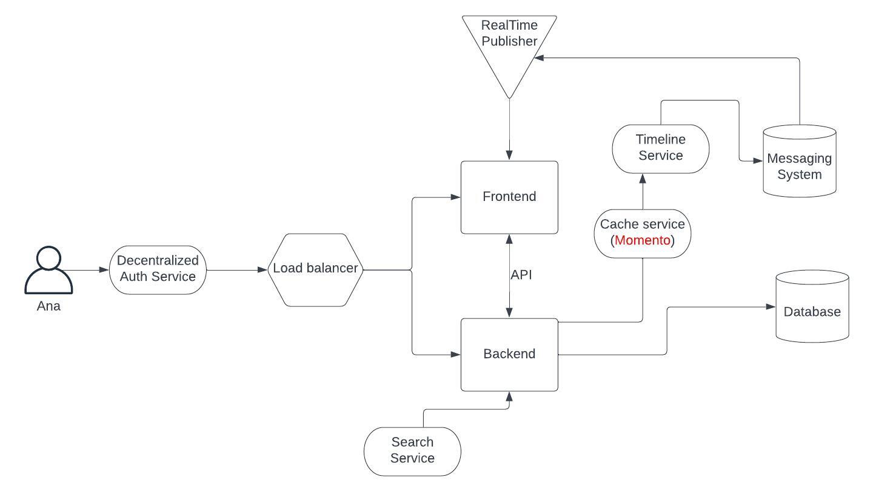
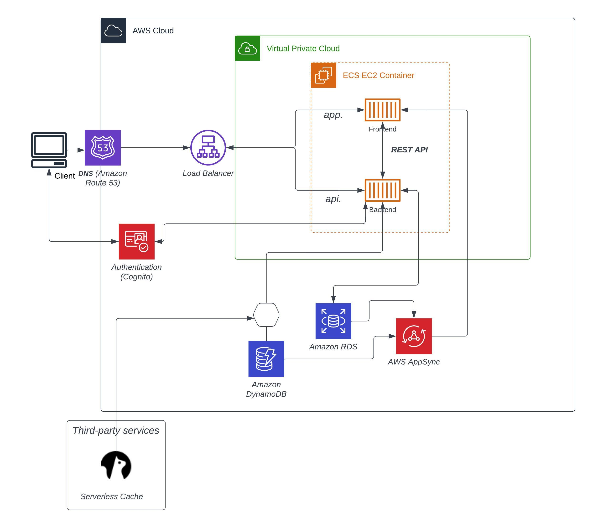

# Week 0 — Billing and Architecture

## Class notes 
This are the notes I took from the livestream lesson:

## Homework Security

- Setup MFA for root
- Create IAM user with admin policy with MFA

  

- Configure Billing preferences
  

- Create a 'Zero Spend Budget'
  

- Create a CloudWatch Billing metric Alert for 10USD dollars
  

  - Confirmed SNS topic to receive email alerts
    

Budget considerations :
- 1 Budget created out of the 2 of the Free Tier
- 1 CloudWatch Alarm out of 9 of thr Free Tier

## Lucid Chart Homework

This is to explain our idea to a business person. There are a lot of ways to communicate. Need to emphasize and show our important features.
Start with a single user. What can the user do? It has a frontend serving a website, a backend that's going to do something to the data. 
 
DumbQuestion: Are users unique? everyone has it's own identity?
>Yes, we need to store stateful data for: "tweets" that need to be deleted (ephemeral) and the identity of the person (in perpetuity)

DQ: Do we show multiple storages? The one for direct messages is different
>Only if you know the need for a different type for db (no need to pick the product)

DQ: Is it highly available?
>We need a load balancer on the frontend to distribute traffic as necessary

DQ: Is the load balancer talking directly to the backend too?
>There's an API, people could hit it. Make it a backend accessible to user, an exposed API.

DQ: There is a real-time component, the messaging system has real-time updates. Do we show it?
>Show them in separate mechanism.

DQ: Show communication between frontend and backend.
>Absolutely, to explain how it works at a high level

DQ: Put the Search service?
>Yes, Where it's gonna live?

Doesn't live in the cluster, it's a big system, it's it own thing

DQ: Authentication?
>They are managed services, put decentralized Service for auth.

DQ: Protection from Ddos  attack?
>We assume the security and scalability is provided by AWS. Unless this is highly secure env, and this happens a lot, this gotta be addressed.

DQ: We need a timeline service, to curate the feed, do we show it?

>If it's a distinguished and it's important, show it
DQ: Imagine if we had a partnership with Momento or special thing
>The person needs to understand the business issue we're trying to solve, put the process name with the tool for that. The use of Momento is a constraint as a pre-selected option.

### Conceptual diagram

### Logical diagram

## Generate AWS Credentials
in construction
## Cloud Shell
in construction

## AWS CLI
in construction