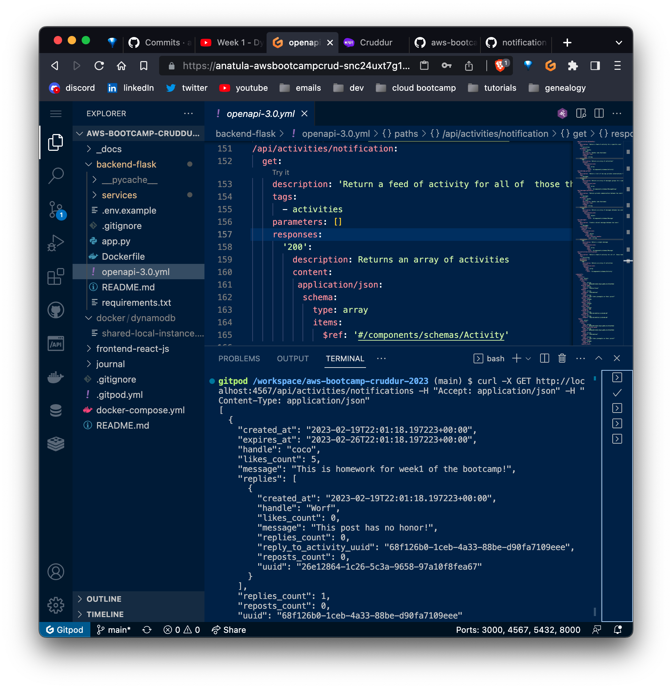
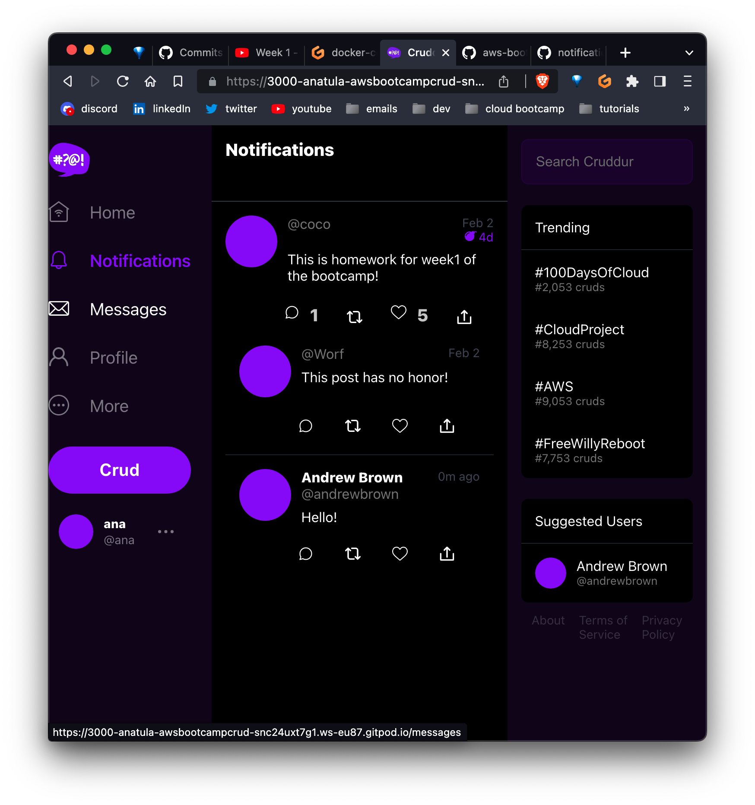
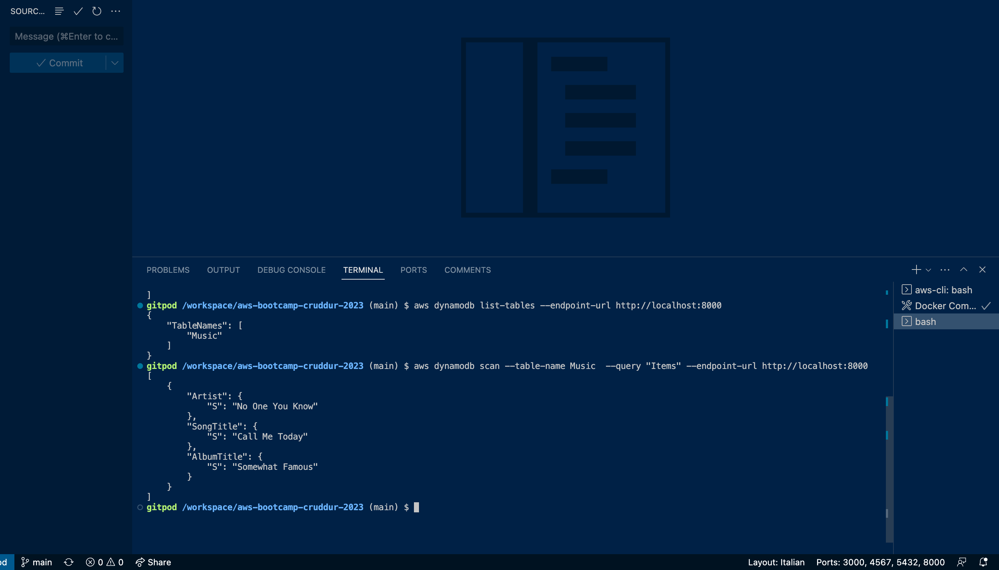
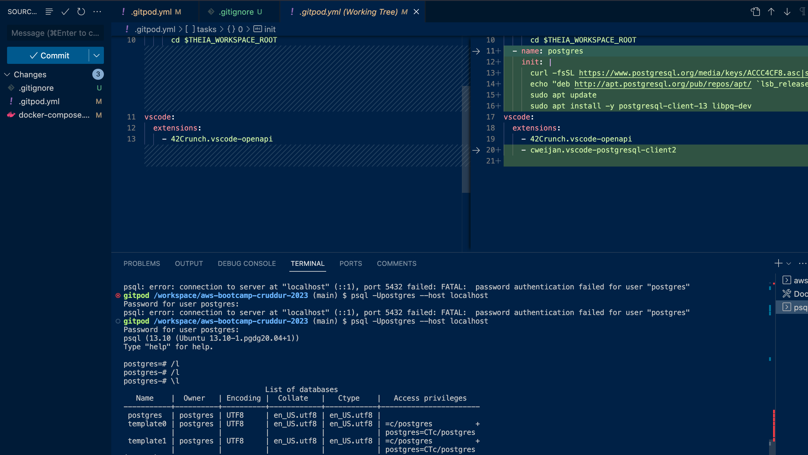

# Week 1 — App Containerization
## Prep material

- [Docker :whale:](./notes/docker.md)
## Class notes 
This are the notes I took from the livestream lesson:


## Homework

### Document the Notification Endpoint for the OpenAI Document
Issue #16 first task, I added a new spec for the notification endpoint.
### Write a Flask Backend Endpoint for Notifications
Issue #16 second task, it shows the openapi spec, and the using the `curl` command call the endpoint to receive the json data.



### Write a React Page for Notifications
Issue #16 last task, added a "This is homework for week1 of the bootcamp!":


### Run DynamoDB Local Container and ensure it works

In issue #17, to test it I used commands from [Andrew's repo](https://github.com/100DaysOfCloud/challenge-dynamodb-local)



### Run Postgres Container and ensure it works
In issue #17, the last task. To test it, run using the command:

 [psql](https://www.postgresql.org/docs/current/app-psql.html) is a terminal-based front-end to PostgreSQL. It enables you to type in queries interactively, issue them to PostgreSQL, and see the query results. Alternatively, input can be from a file or from command line arguments. In addition, psql provides a number of meta-commands and various shell-like features to facilitate writing scripts and automating a wide variety of tasks.

To open a connection locally using the user `postgres` user (with password `password`):
```
psql -U postgres --h localhost
```
To open a remote connection:
```
psql -U doadmin -h production-sfo-test1-do-user-4866002-0.db.ondigitalocean.com -p 25060 -d defaultdb
```
- `-U` is the username (it will appear in the \l command)
- `-h` is the name of the machine where the server is running.
- `-p` is the port where the database listens to connections. Default is 5432.
- `-d` is the name of the database to connect to



When setting up PostgreSQL, whether it’s local or in the cloud, you get three standard databases outside the box: `template0`, `template`, and `postgres`. More on [What are template0, template1 and postgres databases?](https://stackoverflow.com/a/51122978/5425908)

Some useful commands:

|meta-command|shortcut|description|
| ---- | ---- | ---- |
|`\quit`| `\q`| quit the psql
| `\list` | `\l`| get a list of all databases
| `\list db`|`\l db`| to view info about the `db` database

[cheatsheet](https://tomcam.github.io/postgres/)