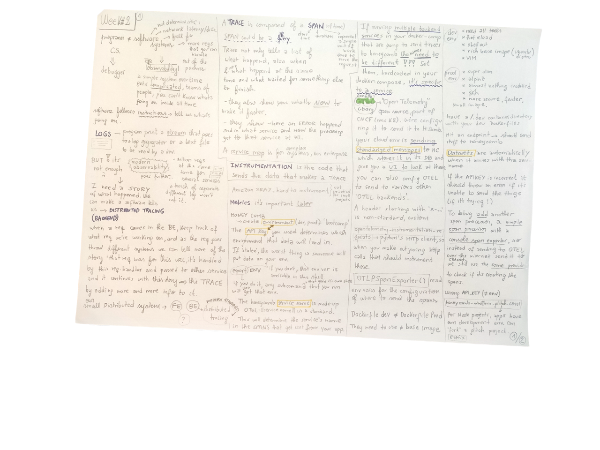
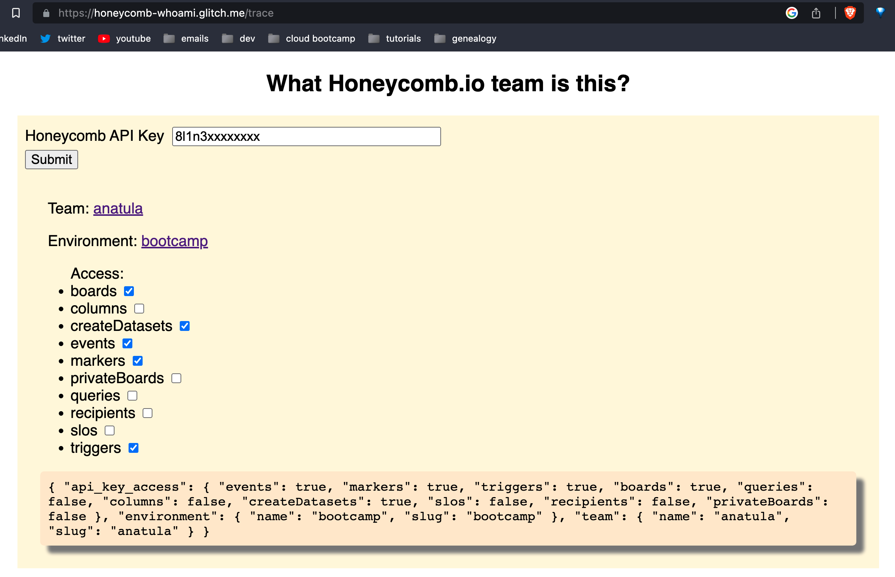

# Week 2 — Distributed Tracing

## Class notes 




## Instrument Honeycomb with OTEL

OTEL ([OpenTelemetry](https://opentelemetry.io/)) is a collection of tools, APIs, and SDKs. Use it to instrument, generate, collect, and export telemetry data (metrics, logs, and traces) to help you analyze your software’s performance and behavior.

[Honeycomb](https://www.honeycomb.io/) attach our flask application backend to Honeycomb UI and then you can analyze the app with honeycomb services.

Some concepts:
- Span: represent a single unit of work done to serve the request. Has a start time, duration. For example, an http request, a db query.
- Trace: composed of a spans (of time)
- Instrumentation: code that sends the data that makes a trace

Follow the instructions [Honeycomb Python OTEL](https://docs.honeycomb.io/getting-data-in/opentelemetry/python/#install-packages).

```console
pip install opentelemetry-api
pip install opentelemetry-sdk
pip install opentelemetry-exporter-otlp-proto-http
pip install opentelemetry-instrumentation-flask
pip install opentelemetry-instrumentation-requests
```

Create an environment `bootcamp` which has a specific `HONEYCOMB_API_KEY`.

The service name `HONEYCOMB_SERVICE_NAME` is a made-up name to identify a each unique service. This will determine the service's name in the spans that get sent from our app.


We're configuring OTEL to send data to Honeycomb. Our app is sending standardized messages to Honeycomb which stores it inside it's database and gives a UI to look at them. How? by example, using OTEL's library `opentelemetry-instrumentation-requests` which uses Python's HTTP client to instrument every out-going request.

You can configure OTEL to send data to other `OTEL backends`.

To debug add another `span processor` a, `simple`, with a `console span exporter` so instead of sending it to OTEL over the internet, sends it to the stdout.


Also, a  useful tool is Jessica's [What Honeycomb.io team is this?](https://honeycomb-whoami.glitch.me/), we pass a `honeycomb api key` and it returns some info about the environment:



A `dataset` was automatically created when data arrived for that environment. A series of charts are shown:


And also shown as a list of recent events:


View trace button, we see the trace where a call happened to a specific url, has a single span, a `root-span` (the top-level one) and nothing happened inside them. We can also see additional info like `attributes` and `fields` that automatically generated thanks to the OTEL instrumentation.

To show a more detail trace, we can hardcode a span, with `mock-data` span with added `fields` In this case, the spans become replaces for logs, because we can get everything we need in the 'story' context. Our app custom attributes usually are prefixed with `app`, and as value any serializable value is okay (number, string, boolean)


`queries` are a way of visualizing data, create custom queries that over all our spans (similar SQL language, but Honeycomb uses a custom db language implementation)  


Show the metric `latency`: how long the request take? duration in milliseconds. `Heatmap` and `P90 percentile` are useful to respond for this, what is the number such that 90% of request are faster than this?


## AWS X-ray

More info of xray in my [aws logging notes](./notes/logging.md#aws-x-ray).

Week's 2 instructions [here.](https://github.com/omenking/aws-bootcamp-cruddur-2023/blob/week-2/journal/week2.md)

Install the xray daemon image docker from DockerHub:
`amazon/aws-xray-daemon`

Create an xray group:
```
aws xray create-group \
   --group-name "Cruddur" \
   --filter-expression "service(\"$FLASK_ADDRESS\")
```

In the xray console:


Create a sampling rule:

```
aws xray create-sampling-rule --cli-input-json file://aws/json/xray.json
```


Using the xray middleware we start sending some segments:


In the console:


A segment in detail looks like this:


### Create a custom sub-segment

Following this [guide](https://github.com/aws/aws-xray-sdk-python#start-a-custom-segmentsubsegment) we created a custom subsegment inside `UserActivities`:


We can visualize it in the console:


Using the capture annotation:


In the console:


## Cloudwatch logs

Created a group called `Cruddr` and import the logger from `app.py` inside `HomeActivities` to send an `info` level log:


## Rollbar

After the [guide]()

We created an endpoint that send `warning` log:

```python
@app.route('/rollbar/test')
def rollbar_test():
    rollbar.report_message('Hello World!', 'warning')
    return "Hello World!"
```

To test if also received `error` we removed the return statement of an endpoint handler method and called it. The result shows the 2 logs: 


## Extra Info

### Git tags

Git Tags will help to tag the last commit of a week, when all the activities are done, to give a visual point in the commit history and make it easy to find.

List existing tags:

`git tag`

Create a new tag (lightweight):

`git tag week2`

To tag commits after you’ve moved past them:

`git tag week2 9fceb02`

By default, the git push command doesn’t transfer tags to remote servers. You will have to explicitly push tags:

`git push --tags`

To delete a local tag in the repo:

`git tag -d week2`

To delete a remote tag:

`git push origin --delete week2`

[More on git tags](https://git-scm.com/book/en/v2/Git-Basics-Tagging)

### Extra: Percentile latency metric
When I say 99 percentile is 10ms means 99% of my requests are less than 10ms. For this calculation we need to sort all the requests, it's not simple. Is an approximation.

[Percentile Tail Latency Explained (95%, 99%) Monitor Backend performance with this metric by Hussein Nasser](https://www.youtube.com/watch?v=3JdQOExKtUY)