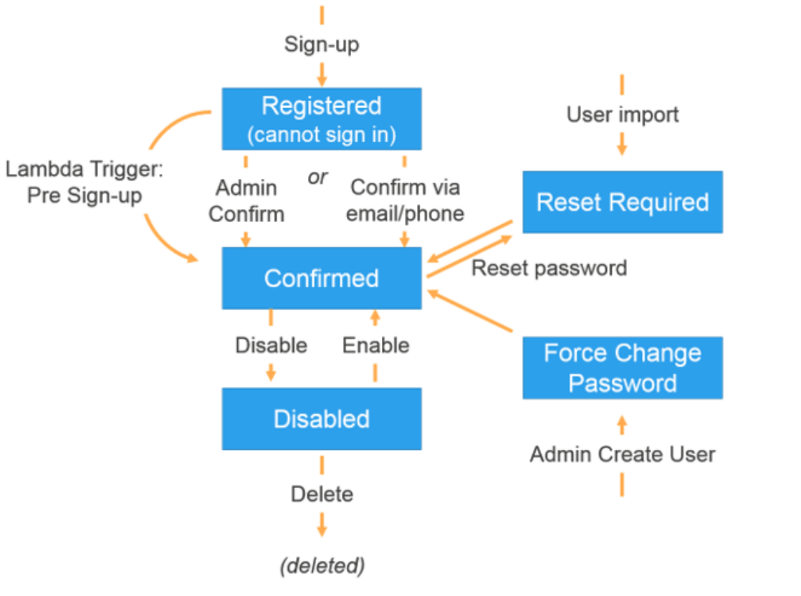
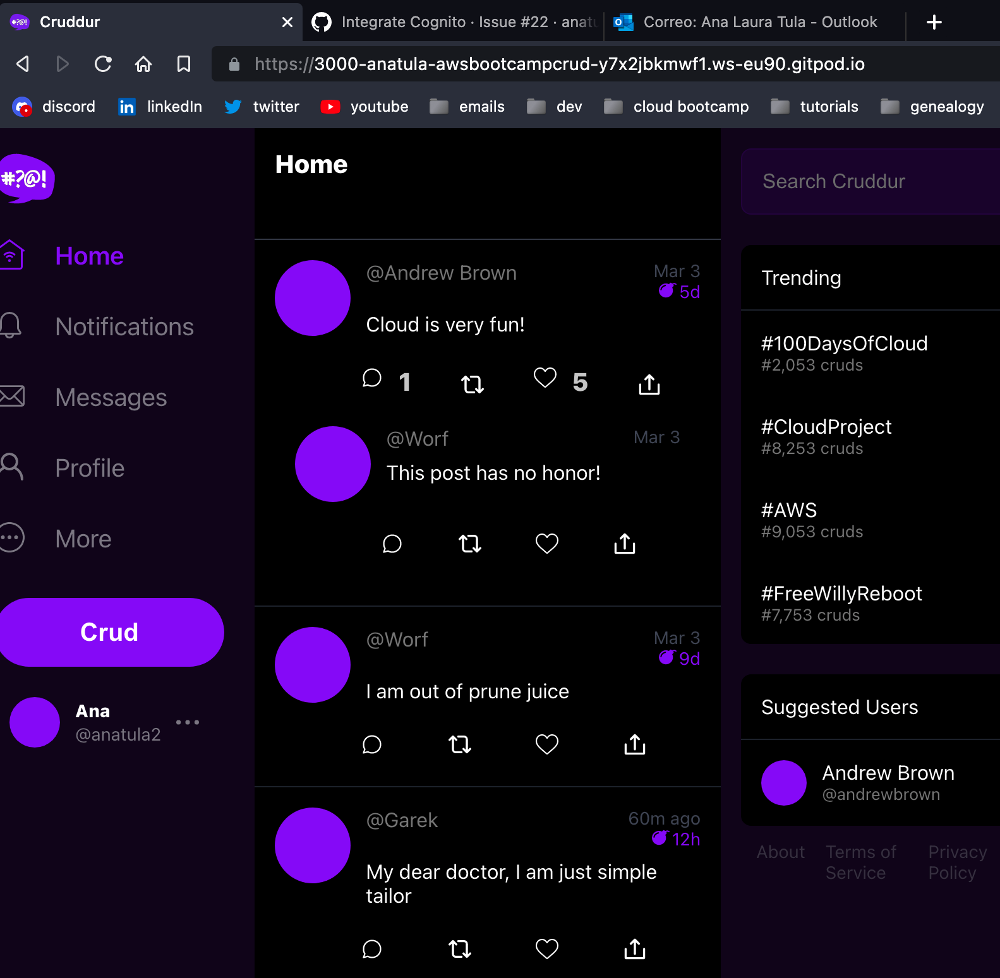
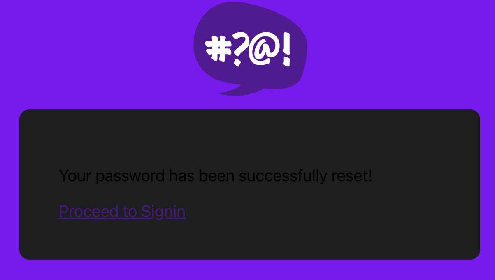
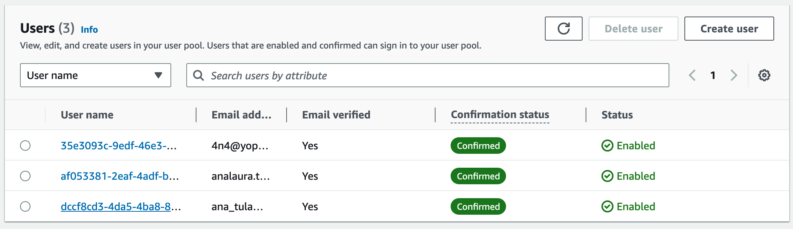
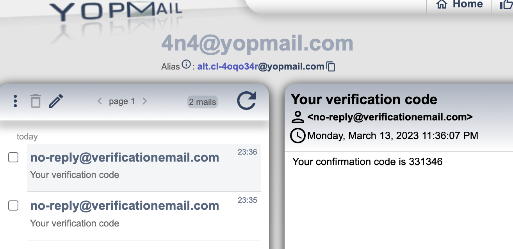
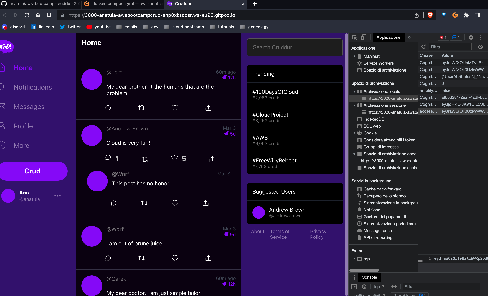

# Week 3 — Decentralized Authentication

## Amazon Cognito
This are my prep notes for Amazon Cognito:


## AWS Amplify

### Introduction 
A 'glue' service that helps you build ***entire apps*** quickly, from frontend to backend or fullstack applications and with different technologies:

- Web apps: Javascript, React, Angular
- Mobile apps: React Native, Android, iOS

Is primarily used as **CLI tool**, but it has a UI that allows to do some tasks.

It allows you to quickly add things like storage, authentication, monitoring, etc. It focuses on delivering the functionality instead of relying on you having to know what aws service to use to achieve that functionality.

Behind the scenes is **CloudFormation**: IaC (infrastructure as code) solution from aws that allows you to write code to deploy your infrastructure out to the cloud.

There are several different functionalities that you can add to a application through a simple cli command like:

- Authentication: Amazon Cognito
- Functions: creating Aws Lambda functions to your code
- DataStore: Amazon DynamoDB
- API (graphQL,REST): AppSync and API gateway
- Storage: S3
- Custom domains: Amazon Route 53

The way to use it is mainly through the CLI so, for example:

- to configure a project, type `amplify configure` and follow the wizard.
- to add an API type `amplify add api` command that will launch another wizard ask and will ask abut: GraphQL, rest, API key, etc.

### In detail

AWS Amplify is an open source framework maintained by AWS which helps developers integrate their applications with AWS resources.

Amplify can be described as 3 important components:
- front-end libraries: the open-source libraries and UI components can be used to add cloud-powered functionality to your apps.
- CLI: open-source interactive toolchain you can use to create and manage a backend for your apps
- console: an AWS service to deploy and host full-stack serverless web apps.
  
You can find here all the Amplify's repos [here](https://github.com/aws-amplify):

From: 
- [Andrew Brown ExamPro Cloud Practitioner Free Course](https://youtu.be/SOTamWNgDKc)
- [Amazon Cognito Beginner Guide by Be A Better Dev](https://www.youtube.com/watch?v=QEGo6ZoN-ao)

## Homework
### User pool
The first step is to create the user pool through the UI with this options:
  - Provider type: Cognito user pool
  - User pool sign-in option: email
  - Password policy: Cognito default
  - No MFA
  - Enable self-recovery
  - Deliver method: email only (SMS costs)
  - Enable self-registration
  - Required attributes (when a new user is created)
    - preferred_username
    - name
  -  Send email with Cognito (this will probably change in the future)
  -  Choose the SES region
  -  Give it a name `cruddur-user-pool`
  -  We're not using the hosted UI
  -  Public client (no server-side authorization so no client secret is needed, in the server we'll only verify the token)
  
The only way to use Cognito client-side is by using the Amplify Javascript library, so to install AWS Amplify library:

  ```console
  cd frontend-react-js
  npm i aws-amplify --save
  ```
From the client-side guide for configuration [Authentication with Amazon Cognito](https://docs.amplify.aws/lib/client-configuration/configuring-amplify-categories/q/platform/js/#authentication-amazon-cognito):

### Env vars
Set this env vars values as env vars:
- REACT_APP_AWS_PROJECT_REGION
- REACT_APP_AWS_COGNITO_REGION
- REACT_APP_AWS_USER_POOLS_ID
- REACT_APP_CLIENT_ID

Prefix with `REACT_APP_`!
More on [add custom environment variables.](https://create-react-app.dev/docs/adding-custom-environment-variables/)

## Create a user manually

To test the sign-in we created a user through the management console. But one more step is needed, according with the confirmation process:


We need to confirm the user using the aws cli:

```console
aws cognito-idp admin-set-user-password \
  --user-pool-id <user-pool-id> \
  --username <username> \
  --password <password> \
  --permanent
```

And now we can sign-in!

[stackoverflow answer](https://stackoverflow.com/a/56948249/5425908)

[admin-set-user-password](https://docs.aws.amazon.com/cli/latest/reference/cognito-idp/admin-set-user-password.html)

## AWS Amplify configuration

From `aws-amplify` import:

- `Amplify` to use our existing Amazon Cognito UserPool modify the  Amplify.configure() method with our data.
  
- `Auth`: it has all the methods we will need to implement the auth flow like signUp, confirmSignUp, signOut.

### Some auth flow screens





In the console management we can see some users created:



Some verification code send:




## Authenticating with tokens

After a user logs in, an Amazon Cognito user pool returns a JWT. The JWT is a base64url-encoded JSON string ("claims") that contains information about the user. Amazon Cognito returns three tokens: 
- the ID token
- the access token
- the refresh token
  
The ID token contains the user fields defined in the Amazon Cognito user pool.

Tokens include three sections:
- a header
- a payload
- a signature

The following is the header of a sample ID token. The header contains the key ID ("kid"), as well as the algorithm ("alg") used to sign the token. In this example, the algorithm is "RS256", which is an RSA signature with SHA-256.

```
{
  "kid": "abcdefghijklmnopqrsexample=",
  "alg": "RS256"
}
```
The following is an example of the payload, which has information about the user, as well as timestamps of the token creation and expiration:

```
{
  "sub": "aaaaaaaa-bbbb-cccc-dddd-example",
  "aud": "xxxxxxxxxxxxexample",
  "email_verified": true,
  "token_use": "id",
  "auth_time": 1500009400,
  "iss": "https://cognito-idp.ap-southeast-2.amazonaws.com/ap-southeast-2_example",
  "cognito:username": "anaya",
  "exp": 1500013000,
  "given_name": "Anaya",
  "iat": 1500009400,
  "email": "anaya@example.com"
}
```

The last section is the signature, which is a hashed and encrypted combination of the header and the payload.

Amazon Cognito generates two RSA key pairs for each user pool. The private key of each pair is used to sign the respective ID token or access token. The public keys are made available at an address in the following format:

`https://cognito-idp.{region}.amazonaws.com/{userPoolId}/.well-known/jwks.json`

**That's why we set this info as env vars!**

The JSON file (jwks.json) is structured in the following format:

```
{
    "keys": [{
        "alg": "RS256",
        "e": "AQAB",
        "kid": "abcdefghijklmnopqrsexample=",
        "kty": "RSA",
        "n": "lsjhglskjhgslkjgh43lj5h34lkjh34lkjht3example",
        "use": "sig"
    }, {
        "alg":
        "RS256",
        "e": "AQAB",
        "kid": "fgjhlkhjlkhexample=",
        "kty": "RSA",
        "n": "sgjhlk6jp98ugp98up34hpexample",
        "use": "sig"
    }]
}
```
To verify the signature of an Amazon Cognito JWT, first search for the public key with a key ID that matches the key ID in the header of the token. Then, you can use libraries, such as aws-jwt-verify or those recommended by jwt.io or OpenID Foundation, to validate the signature of the token and extract values, such as expiration and user name.

Apart from the signature, it's also a best practice to verify the following:

- The token isn't expired.
- The audience ("aud") specified in the payload matches the `app client ID` created in the Amazon Cognito user pool. 


Info:
[How can I decode and verify the signature of an Amazon Cognito JSON Web Token?](https://aws.amazon.com/it/premiumsupport/knowledge-center/decode-verify-cognito-json-token/)

## Token validation

In the backend we used a bit of code of the open source library [Flask-AWSCognito](https://flask-awscognito.readthedocs.io/en/latest/), we couldn't use it 100% since it didn't support our auth flow. We need:

- method `extract_access_token`: reads the header and extracts the access_token
- class `CognitoJwtToken`: our verifier, it extract the token, verifies the signature, checks the expiration,audience and returns the claims.
  - The *claims* in tokens are information about your user like username, family name, and email address.
  - The *audience* ("aud") specified in the payload matches the app client ID created in the Amazon Cognito user pool.

## UI tweak (add theme)

We've added some css variables to set some colors like background, foreground. The app was a bit dark, but now it looks so much better:



AND we can see it has the access_token set in the localStorage!

