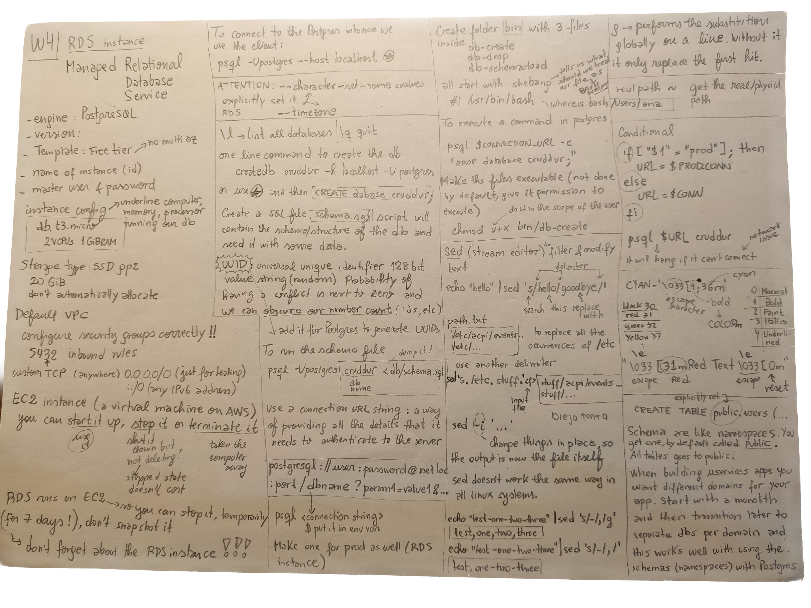
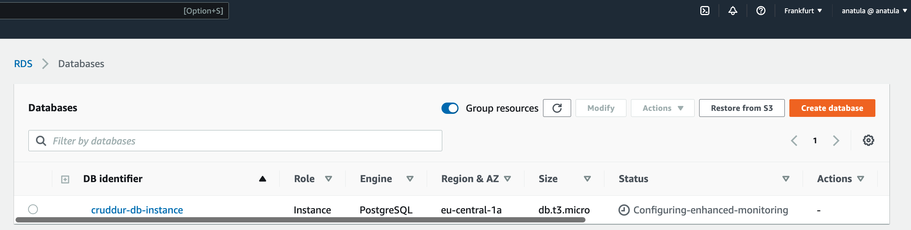
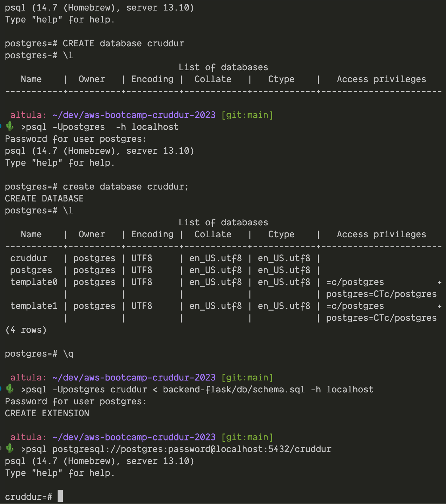
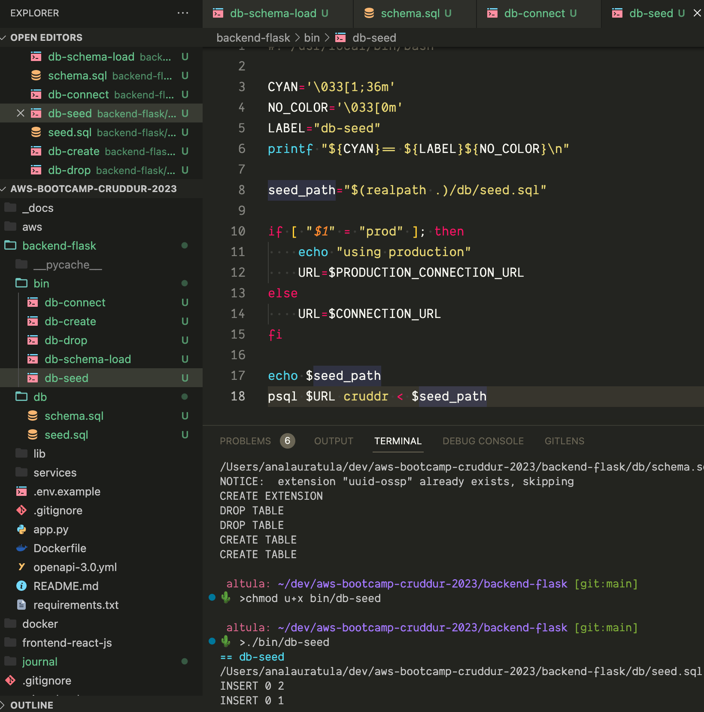

# Week 4 — Postgres and RDS
## Class notes


## Homework

Check your credentials: 

`aws sts get-caller-identity`

Create an RDS instance using the CLI command:
```
aws rds create-db-instance \
  --db-instance-identifier cruddur-db-instance \
  --db-instance-class db.t3.micro \
  --engine postgres \
  --engine-version  14.6 \
  --master-username cruddurroot \
  --master-user-password gooddb!Password123 \
  --allocated-storage 20 \
  --availability-zone eu-central-1a \
  --backup-retention-period 0 \
  --port 5432 \
  --no-multi-az \
  --db-name cruddur-db \
  --storage-type gp2 \
  --publicly-accessible \
  --storage-encrypted \
  --enable-performance-insights \
  --performance-insights-retention-period 7 \
  --no-deletion-protection
```
The response is a JSON file: 
```
{
    "DBInstance": {
        "DBInstanceIdentifier": "cruddur-db-instance",
        "DBInstanceClass": "db.t3.micro",
        "Engine": "postgres",
        "DBInstanceStatus": "creating"
    }
    ...
}
```
In the RDS console:



You can stop **temporally** the RDS database instance for max. 7 days, then it will run again!

Created scripts for connect, drop..



And the last one, to seed the data:




