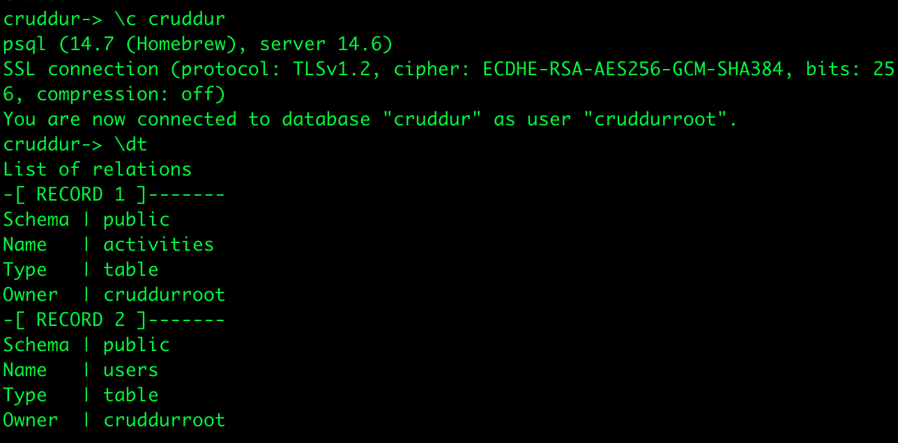
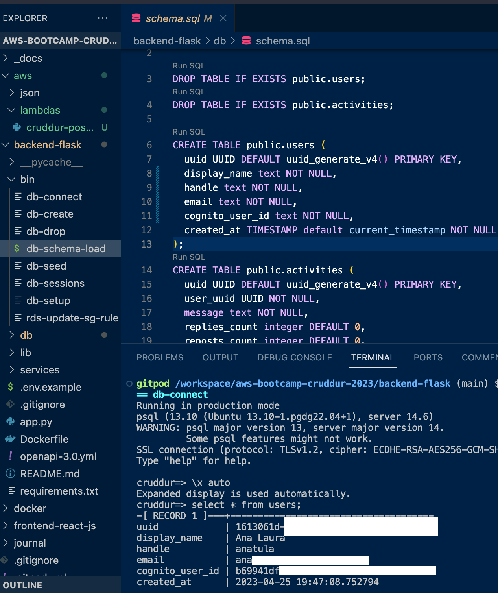
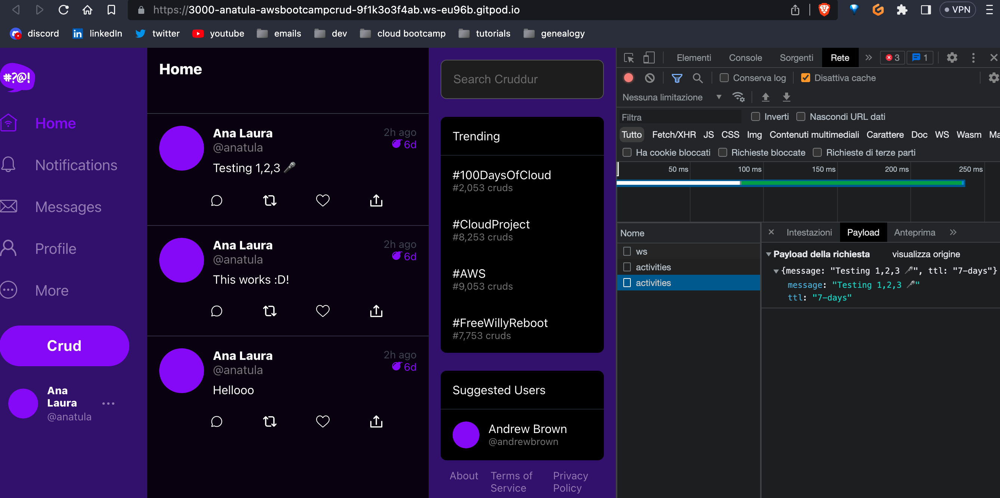

# Week 4 — Postgres and RDS
## Class notes


## Homework

Check your credentials: 

`aws sts get-caller-identity`

Create an RDS instance using the CLI command:
```
aws rds create-db-instance \
  --db-instance-identifier cruddur-db-instance \
  --db-instance-class db.t3.micro \
  --engine postgres \
  --engine-version  14.6 \
  --master-username cruddurroot \
  --master-user-password gooddb!Password123 \
  --allocated-storage 20 \
  --availability-zone eu-central-1a \
  --backup-retention-period 0 \
  --port 5432 \
  --no-multi-az \
  --db-name cruddur-db \
  --storage-type gp2 \
  --publicly-accessible \
  --storage-encrypted \
  --enable-performance-insights \
  --performance-insights-retention-period 7 \
  --no-deletion-protection
```
The response is a JSON file: 
```
{
    "DBInstance": {
        "DBInstanceIdentifier": "cruddur-db-instance",
        "DBInstanceClass": "db.t3.micro",
        "Engine": "postgres",
        "DBInstanceStatus": "creating"
    }
    ...
}
```
In the RDS console:


You can stop **temporally** the RDS database instance for max. 7 days, then it will run again!

Created scripts for connect, drop..


And the last one, to seed the data:


### Connect to remote RDS instance

In order to connect to our RDS instance we need to provide our Gitpod IP and whitelist it for inbound traffic on port 5432. So, we need the Gitpod IP on new env var (and update it every time it starts in a command step for postgres) and then we'll get the `security group rule id` and the `security group id` so we can easily modify it in the future from the terminal Gitpod on start:

```bash
aws ec2 modify-security-group-rules \
    --group-id $DB_SG_ID \
    --security-group-rules "SecurityGroupRuleId=$DB_SG_RULE_ID,SecurityGroupRule={IpProtocol=tcp,FromPort=5432,ToPort=5432,CidrIpv4=$GITPOD_IP/32}"
```

After the this configuration the `psql` no longer hangs, and connects to the instance:



### Post-confirmation Lambda

We created a lambda function:
- x86_64 architecture and Python 3.8 runtime
- add the lambda function as a Post Confirmation lambda trigger.
- Added env. vars for DB connection
- in same VPC (default) as the RDS instance: we need to give the required network interface related permission to deploy a lambda in a VPC. Created a new policy `AWSLambdaVPCAccessExecutionRole`:

```json
{
    "Version": "2012-10-17",
    "Statement": [
        {
            "Effect": "Allow",
            "Action": [
                "ec2:DescribeNetworkInterfaces",
                "ec2:CreateNetworkInterface",
                "ec2:DeleteNetworkInterface",
                "ec2:DescribeInstances",
                "ec2:AttachNetworkInterface"
            ],
            "Resource": "*"
        }
    ]
}
```
- added missing compiled psycopg2 C library for Python. To add the layers add a reference for your region:
- 
`arn:aws:lambda:eu-central-1:898466741470:layer:psycopg2-py38:1`

(or compile and update your own layer for more security)

The result:



### Created activities

Coded the three main functionalities to regarding activities: selecting and creating. We did a few changes to our `db.py` library.

At last, the newly created activities for my (hardcoded) user handle:




