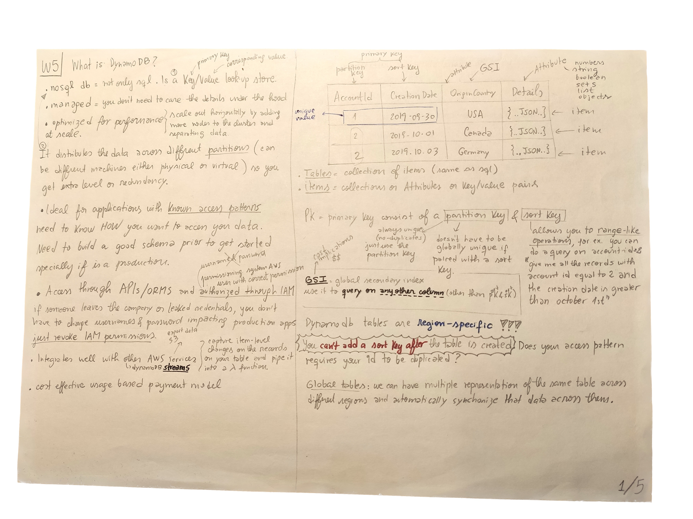
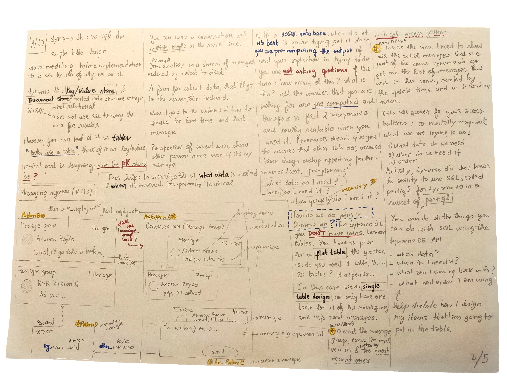
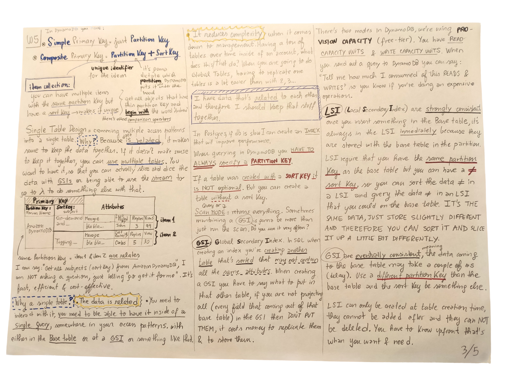

# Week 5 — DynamoDB and Serverless Caching

## Class notes






### Steps to run the db's scripts locally

We'll start using dynamodb and postgres locally, to avoid consuming a lot of Gitpod credits.

Do a `docker-compose up`, selecting only the `db` service.

To create table dynamodb, we are using the sdk. Using python 3, since it's installed by default in mac:

Installed `boto3` using:

`pip3 install -r requirements.txt`

`docker network create dynamo-local-network`

```
docker run -d -p 8000:8000 --network=dynamo-local-network --name dynamo-local amazon/dynamodb-local -jar DynamoDBLocal.jar -sharedDb
```

After just: `docker start dynamo-local`

To connect to local dynamodb: 
```
aws dynamodb list-tables --endpoint-url http://localhost:800
Need 3 envs:
export AWS_ACCESS_KEY_ID=dummy
export AWS_SECRET_ACCESS_KEY=dummy
export AWS_DEFAULT_REGION=eu-central-1
```
### Boto3 Resource vs Client

**Clients** provide the low-level interface as closely with service APIs. Which means, all service operations will be supported by clients.

Whereas, the **Resources** provide a hig-level interface which means differently than the raw low-level calls provided by Clients.

### Implement Conversations with DynamoDB

Created `lib/ddb.py`, the difference with `db.py` is that it's a stateless class (tip: try to do things without state, because it's easier to test, you've got only the input/outputs).

Created `bin/cognito/list-users`:

It's almost a 1-to-1 match between the CLI and the SDK:

```bash
aws cognito-idp list-users --user-pool-id=eu-central-1_xxxxxx
```

```python
response = client.list_users(
    UserPoolId='string',
    AttributesToGet=[
        'preferred_username',
        'sub'
    ],
    #Limit=123,
    #PaginationToken='string',
    ]#Filter='string'
)
```
### Helpful links

- [dynamodb-with-python-boto3](https://iamvickyav.medium.com/aws-dynamodb-with-python-boto3-part-1-intro-to-dynamodb-local-installation-b168d9d762d5)


